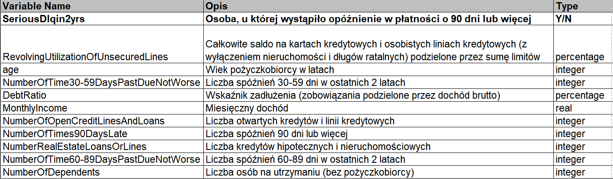

Pobranie danych

```{r}
dane <- read.csv("data/cs-training.csv")
```

# Poznanie danych



## Dane statystyczne

```{r}
dim(dane)

str(dane)
```

```{r}
head(dane)
```

```{r}
summary(dane)
```

```{r}
colSums(is.na(dane))
```

## Wstępne histogramy

```{r}
library(ggplot2)

colnames(dane)

for (kolumna in colnames(dane)) {
  if (is.numeric(dane[[kolumna]])) {
    plot <- ggplot(dane, aes(x = .data[[kolumna]])) +
      geom_histogram(fill = "steelblue", color = "black", linewidth = 0.3, alpha = 0.8) +
      theme_minimal()
    print(plot)
  }
}
```

**Wnioski**:

- Dane odstające dla wielu kolumn
- Niezbilanoswanie danych
- Istniejące braki danych
- Błędny wiek (poniżej 18 lat)


# Przygotowanie danych

## Czyszczenie danych

```{r}
dane$X <- NULL

dane <- subset(dane, age >= 18)

dane$MonthlyIncome[is.na(dane$MonthlyIncome)] <- median(dane$MonthlyIncome, na.rm = TRUE)
dane$NumberOfDependents[is.na(dane$NumberOfDependents)] <- median(dane$NumberOfDependents, na.rm = TRUE)
```

## Podział na zbiór treningowy i testowy

```{r}
set.seed(42)
indeksy <- sample(1:nrow(dane), 0.85 * nrow(dane))
train_data <- dane[indeksy, ]
test_data <- dane[-indeksy, ]
```

## Przygotowanie danych pod analize

```{r}
dane <- as.data.frame(lapply(train_data, function(x) {
  if(is.numeric(x)) {
    limit <- quantile(x, 0.99, na.rm = TRUE)
    x[x > limit] <- limit
  }
  return(x)
}))

saveRDS(dane, "data/cs-cleaned.rds")
```

# Analiza

## Analiza jednowymiarowa

```{r}
library(ggplot2)

colnames(dane)

for (kolumna in colnames(dane)) {
  if (is.numeric(dane[[kolumna]])) {
    plot <- ggplot(dane, aes(x = .data[[kolumna]])) +
      geom_histogram(fill = "steelblue", color = "black", linewidth = 0.3, alpha = 0.8) +
      theme_minimal()
    print(plot)
  }
}
```

## Analiza wielowymiarowa

Histogramy

```{r}
for (kolumna in colnames(dane)) {
  if (is.numeric(dane[[kolumna]]) && kolumna != "SeriousDlqin2yrs") {
    
    p <- ggplot(dane, aes(x = .data[[kolumna]], fill = as.factor(SeriousDlqin2yrs))) +
      # after_stat(density) sprawia, że wykres jest znormalizowany
      geom_histogram(aes(y = after_stat(density)), 
                     bins = 50, 
                     alpha = 0.5,           # Przezroczystość, żeby widzieć obie grupy
                     position = "identity") + # Nakładanie na siebie
      theme_minimal() +
      labs(title = paste("Znormalizowany rozkład:", kolumna),
           x = kolumna,
           y = "Gęstość (Prawdopodobieństwo)",
           fill = "SeriousDlqin2yrs")
    
    print(p)
  }
}
```

Boxploty

```{r}
for (kolumna in colnames(dane)) {
  if (is.numeric(dane[[kolumna]]) && kolumna != "SeriousDlqin2yrs") {
    plot <- ggplot(dane, aes(x = as.factor(SeriousDlqin2yrs), y = .data[[kolumna]])) +
      geom_boxplot(fill = "steelblue") +
      theme_minimal() +
      labs(title = paste("Rozkład:", kolumna), y = "Wartość", x = "SeriousDlqin2yrs")
    
    print(plot)
  }
}
```

## Korelacja

```{r}
library(corrplot)

macierz_kor <- cor(dane, use = "complete.obs")

corrplot(macierz_kor, 
         method = "color", 
         type = "lower",
         tl.cex = 0.7,
         tl.srt = 20,
         tl.col = "black",
         addCoef.col = "black",
         number.cex = 0.5)
```

# Tworzenie modelu XGBoost

## Oversampling SMOTE

"scale_pos_weight [default=1]

Control the balance of positive and negative weights, useful for unbalanced classes. A typical value to consider: sum(negative instances) / sum(positive instances)."

```{r}
# library(smotefamily)
# 
# features_train <- train_data[, -which(names(train_data) == "SeriousDlqin2yrs")]
# target_train <- train_data$SeriousDlqin2yrs
# 
# features_train_scaled <- scale(features_train)
# train_center <- attr(features_train_scaled, "scaled:center")
# train_scale <- attr(features_train_scaled, "scaled:scale")
# 
# smote_result <- SMOTE(as.data.frame(features_train_scaled), target_train, K = 5, dup_size = 0)
# train_smote <- smote_result$data
# 
# colnames(train_smote)[ncol(train_smote)] <- "SeriousDlqin2yrs"
# train_smote$SeriousDlqin2yrs <- as.numeric(train_smote$SeriousDlqin2yrs)
```

## Przygotowanie danych

```{r}
library(xgboost)

dtrain <- xgb.DMatrix(
  data = as.matrix(train_data[, -which(names(train_data) == "SeriousDlqin2yrs")]),
  label = train_data$SeriousDlqin2yrs
)

dtest <- xgb.DMatrix(
  data = as.matrix(test_data[, -which(names(test_data) == "SeriousDlqin2yrs")]),
  label = test_data$SeriousDlqin2yrs
)
```

## Params i Cross-Validation

```{r}
sum_negative <- sum(train_data$SeriousDlqin2yrs == 0)
sum_positive <- sum(train_data$SeriousDlqin2yrs == 1)
spw_value <- sum_negative / sum_positive
saveRDS(spw_value, file = "spw_value.rds")

params <- list(
  objective = "binary:logistic",
  max_depth = 6,
  eta = 0.1,
  eval_metric = c("auc", "aucpr"),
  scale_pos_weight = spw_value
)

cv_results <- xgb.cv(
  params = params,
  data = dtrain,
  nrounds = 100,
  nfold = 5,
  stratified = TRUE,
  early_stopping_rounds = 10,
  maximize = TRUE,              # Wskazuje, że wyższe wartości AUC/AUCPR są lepsze
  print_every_n = 10,
  verbose = TRUE
)
```

## Walidacja

```{r}
best_iteration <- which.max(cv_results$evaluation_log$test_aucpr_mean)

# Wartości dla optymalnej iteracji
best_auc <- cv_results$evaluation_log$test_auc_mean[best_iteration]
best_aucpr <- cv_results$evaluation_log$test_aucpr_mean[best_iteration]

cat(sprintf("Optymalna iteracja (wg AUCPR): %d\n", best_iteration))
cat(sprintf("Średnie AUC (test) w %d iteracji: %.4f\n", best_iteration, best_auc))
cat(sprintf("Średnie AUCPR (test) w %d iteracji: %.4f\n", best_iteration, best_aucpr))
```
## Wykres AUCPR

```{r}
library(ggplot2)

# Ekstrakcja logów z wyników CV
log_data <- cv_results$evaluation_log

# Rysowanie krzywej uczenia dla AUCPR
ggplot(log_data, aes(x = iter)) +
  geom_line(aes(y = train_aucpr_mean, color = "Zbiór treningowy"), linewidth = 1) +
  geom_line(aes(y = test_aucpr_mean, color = "Zbiór walidacyjny (CV)"), linewidth = 1) +
  geom_vline(xintercept = best_iteration, linetype = "dashed", color = "black") +
  annotate("text", x = best_iteration-25, y = max(log_data$train_aucpr_mean), 
           label = sprintf("Optymalna iteracja (%d)", best_iteration), hjust = -0.1) +
  labs(
    title = "Krzywa uczenia XGBoost - AUCPR",
    x = "Liczba iteracji (drzew)",
    y = "Średnie AUCPR",
    color = "Zbiór"
  ) +
  theme_minimal() +
  scale_color_manual(values = c("Zbiór treningowy" = "blue", "Zbiór walidacyjny (CV)" = "red"))
```

## Trenowanie modelu i zapis

```{r}
xgb_model <- xgb.train(
  params = params,
  data = dtrain,
  nrounds = best_iteration,
  watchlist = list(train = dtrain, test = dtest),
  print_every_n = 10
)

xgb.save(xgb_model, "model_credit_scoring_cv.model")
```
```{r}
library(ROCR)
library(ggplot2)
library(caret)

features_test <- setdiff(names(test_data), "SeriousDlqin2yrs")
dtest_matrix <- xgb.DMatrix(data = as.matrix(test_data[, features_test]))

preds_raw <- predict(xgb_model, dtest_matrix)
preds <- preds_raw / (preds_raw + spw_value * (1 - preds_raw))

pred_obj <- prediction(preds, test_data$SeriousDlqin2yrs)
perf <- performance(pred_obj, "prec", "rec")

df_pr <- data.frame(Recall = perf@x.values[[1]], Precision = perf@y.values[[1]])
df_pr <- na.omit(df_pr)

thresh <- 0.1

thresh_class <- ifelse(preds > thresh, 1, 0)
pt_rec <- mean(thresh_class[test_data$SeriousDlqin2yrs == 1])
pt_prec <- sum(thresh_class == 1 & test_data$SeriousDlqin2yrs == 1) / sum(thresh_class == 1)

ggplot(df_pr, aes(x = Recall, y = Precision)) +
  geom_line(color = "blue", linewidth = 1) +
  annotate("point", x = pt_rec, y = pt_prec, color = "red", size = 4) +
  theme_minimal() +
  labs(title = sprintf("Krzywa Precision-Recall z progiem (%s)", thresh))

preds_class <- ifelse(preds > thresh, 1, 0)

conf_matrix <- confusionMatrix(
  data = factor(preds_class, levels = c(0, 1)), 
  reference = factor(test_data$SeriousDlqin2yrs, levels = c(0, 1)),
  positive = "1"
)

print(conf_matrix)
```